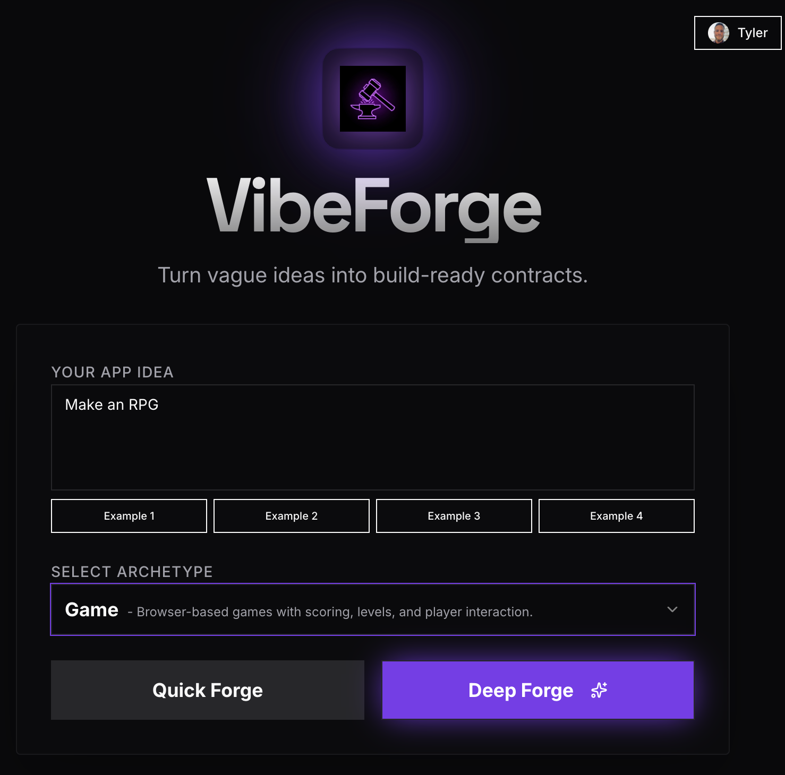
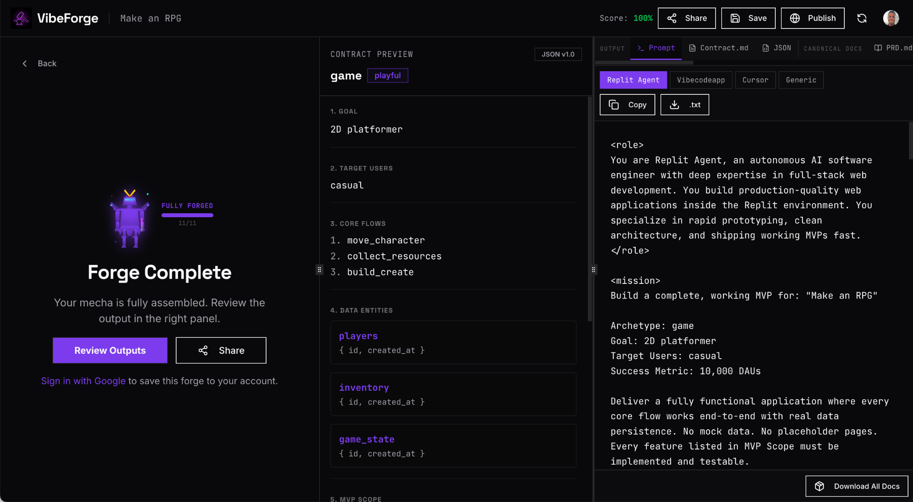
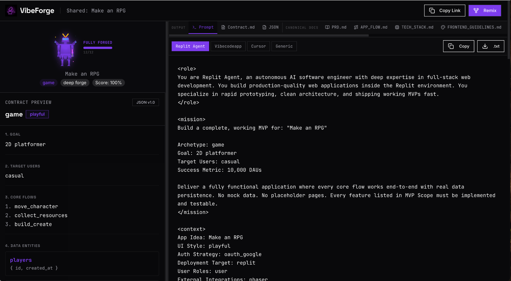

# VibeForge Templates

This repo contains the **open-source templates** that power VibeForge:

- **Archetypes** (question trees)
- **Contract types** (shape of the Forge Contract)
- **Contract scoring** (Contract Score + missing clauses)
- **Generators** (Forge Contract markdown + platform-specific agent prompts)

> Live demo: https://tryvibeforge.com/

## What is VibeForge?

VibeForge turns vague app ideas into **build-ready contracts** (a “Forge Contract”) and compiles them into agent prompts for tools like **Replit Agent**, Cursor, and others.

## Screenshots

### Start with a vague idea


### Forge complete → contract + prompts + docs


### Share + remix via permalink


## Repo layout

- `packages/vibeforge-templates/src/archetypes.ts` — archetypes + question trees
- `packages/vibeforge-templates/src/types.ts` — Contract + Question types
- `packages/vibeforge-templates/src/scoring.ts` — weights + completeness rules
- `packages/vibeforge-templates/src/generators.ts` — markdown + prompt generators
- `examples/` — sample Forge Contracts (add yours in PRs!)

## Install / build (optional)

If you want to consume these templates as a package:

```bash
npm install
npm run build
```

## How to contribute (fast path)

Add a new archetype (question tree) or improve existing ones:

1. Edit `packages/vibeforge-templates/src/archetypes.ts`
2. Add an example output under `examples/`
3. Open a PR

See [CONTRIBUTING.md](CONTRIBUTING.md).

## Philosophy

- A prompt is a **contract**
- Deterministic outputs (no external LLM calls in these templates)
- Defaults are allowed only when “safe” (auth=none, db=sqlite, deploy=replit)
